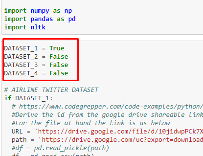
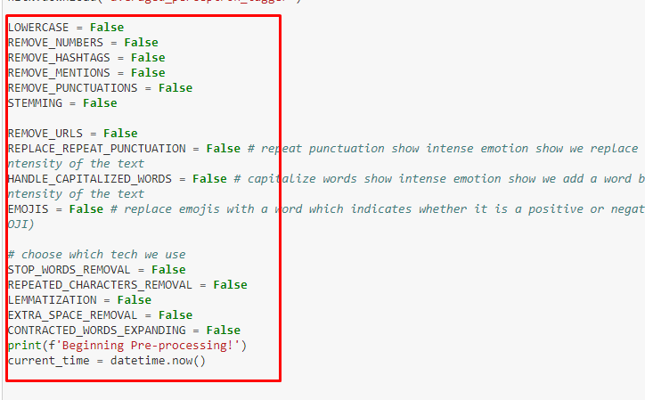

# Bert-based-preprocessing-techniques-acceleration

This repository contains the code needed to run the experiments in the "Bert Based Evaluation of Preprocessing Techniques" paper.

The primary purpose of the paper mentioned above is to examine and compare 15 preprocessing techniques described in the literature and adjusted in four SA datasets, using the uncased Bert-base model. To accomplisht hat, we train the model with every preprocessing technique for all datasets, and then we analyze results.

## Preprocessing techniques

We use the following preprocessing techniques:

1. Stemming
2. Lemmatization
3. Lowercasing
4. Contracted words expansion
5. Emojis and Emoticons Handling
6. Repetition punctuation replacement
7. Capitalized words handling
8. Remove urls
9. Remove numbers
10. Remove stop words
11. Remove hashtags
12. Remove extra space
13. Remove punctuation
14. Remove repeated characters
15. Remove mentions

## Datasets

We used the following Sentiment Analysis Datasets:

1. [Twitter US Airline Sentiment](https://www.kaggle.com/crowdflower/twitter-airline-sentiment)
2. [Consumer Reviews of Amazon Products](https://www.kaggle.com/datafiniti/consumer-reviews-of-amazon-products) 
3. [Automotive Products Reveiw](https://jmcauley.ucsd.edu/data/amazon/)
4. [Sentiment Self-driving Cars](https://data.world/crowdflower/sentiment-self-driving-cars)

For each one of the above datasets, we have created a shared file in drive that we use in our code to get the data:

1. Dataset 1: [Twitter US Airline Sentiment](https://drive.google.com/file/d/10j1dwpPCk7XAHCTX7gczX2woXzMZ5Dva/view)
2. Dataset 2: [Consumer Reviews of Amazon Products](https://drive.google.com/file/d/1EbWy4GSV_Ano6OlOiXZaNuqmJrnc95p5/view) 
3. Dataset 3: [Automotive Products Reveiw](https://drive.google.com/file/d/1-ST5Wffhx9ky56Qh7KEkbfhMd9MRY97d/view)
4. Dataset 4: [Sentiment Self-driving Cars](https://drive.google.com/file/d/1XeIrsFJkOnAaly_YxyOQ8pj18b_yilTA/view)

## Bert-base model

We used the uncased Bert-base model that can be found [here](https://tfhub.dev/google/bert_uncased_L-12_H-768_A-12/1).

## Getting Started

This section presents the guidelines that will help you run the Bert_based_evaluation.ipynb file for every dataset and every preprocessing technique to get the accuracy of Bert-base model for each experiment.

### Prerequisites

In order to run the Bert_based_evaluation.ipynb file you need to copy [this sheet](https://docs.google.com/spreadsheets/d/1aG9SegoFhS4J8TbGwPhQiWQsYqqAoJnmdu6idd0OM3g/edit?usp=sharing) in your google drive.   

If you are not able to copy the sheet, then you should create it on your own. Particularly, you need to create a google sheet called **Bert results**. In this sheet, you should add the following 8 columns:
1. A1 cell: preprocessing techniques
2. B1 cell: eval_accuracy	
3. C1 cell: false_negatives	
4. D1 cell: false_positives	
5. E1 cell: loss	
6. G2 cell: true_negatives	
7. H1 cell: true_positives	
8. I1 cell: global_step

This file will include the results of Bert-model, after running the code.

### Installation

In order to run the experiments, you need to install the Bert_based_evaluation.ipynb in your [google colab](https://colab.research.google.com/). To do so, follow the steps bellow:

**Step 1**: Create a new colab file and choose upload notebook.  

**Step 2**: Click Github.   

**Step 3**: Choose this repository.  

**Step 4**: Upload Bert_based_evaluation.ipynb.

### Implementation

To get the accuracy for each dataset and each preprocessing technique, you need to run the code for each one of the combination dataset-preprocessing technique separately. To do so, you need to change the section of the code that indicated which dataset you want to use and which preprocessing technique.  

**Example1**: If you want to get the accuracy of the Dataset_1 (Twitter US Airline Sentiment) without applying any technique, you need to put the value of Dataset_1 equal to True, and make sure that all the other datasets are equal to False as well as all the preprocessing techniques are equal to false as shown below.   

  

  

**Example2**: If you want to get the accuracy of the Dataset_1 (Twitter US Airline Sentiment) when applying lowercasing technique, you need to put the value of Dataset_1 equal to True, and make sure that all the other datasets are equal to False adn you also need to put the value True to the lowarcase variable and make sure that all the other techniques are equal to False.  

After running an experiment, the results will be saved in the Bert results sheet in your google drive.  

***Note**: the first time you will run the code, you will be ask to authenticate your account in order to be able to save the results in your google sheet.*

### Analysis

You can also reproduce the tables and the heatmaps shown in the paper by running results_analysis.ipynb code in your colab account.
